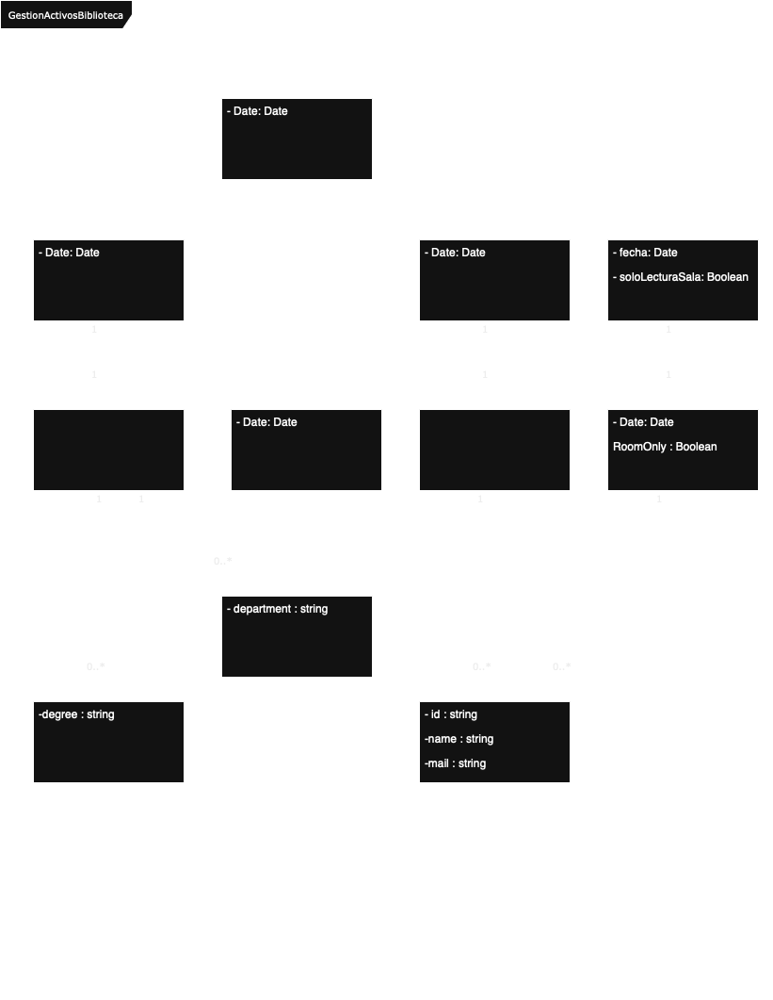

**Author:** Antonio Ortiz
**Date:** 25/04/2025
**Degree:** Computer Engineering   
**Subject:** Software Engineering  
**Assignment:** Activity 1 – Process Model & Class Design  

---

## 🧠 Context

This assignment involved the analysis of functional requirements for a university library system and the modeling of its core components using UML class diagrams. The design includes resources (spaces and books), users (students and teachers), and the different types of reservations possible in the system.

---

## 🖼 UML Class Diagram

The following UML class diagram represents the designed structure of the library reservation system.

---

## 🧩 Class Descriptions

| **Class**             | **Description**                                                                                                                                                              |
|-----------------------|------------------------------------------------------------------------------------------------------------------------------------------------------------------------------|
| `Space`               | General class representing a physical resource in the library.                                                                                                               |
| `ReadingSeat`         | Subclass of `Space`.                                                                                                                                                         |
| `StudyRoom`           | Subclass of `Space`.                                                                                                                                                         |
| `User`                | General class representing any individual who interacts with the library.                                                                                                   |
| `Student`             | Subclass of `User`, with the attribute `degree : string`.                                                                                                                    |
| `Teacher`             | Subclass of `User`, with the attribute `department : string`.                                                                                                                |
| `Book`                | Represents a library book, with attributes `fecha : Date` and `soloLecturaSala : Boolean`. Indicates whether the book is restricted to in-room reading only.                |
| `SpaceReservation`    | Represents the reservation of a space (seat or room) by a user, with attribute `Date`.                                                                                       |
| `RoomReservation`     | Subclass of `SpaceReservation`, used for study rooms.                                                                                                                        |
| `SeatReservation`     | Subclass of `SpaceReservation`, used for reading seats.                                                                                                                      |
| `BookReservation`     | Represents a book reservation, with attribute `RoomOnly : Boolean`. Indicates if a room reservation is required to allow the book reservation.                              |

---

## 🔗 Class Hierarchies (Generalization)

| **Generalization**             | **Description**                                                                                     |
|--------------------------------|------------------------------------------------------------------------------------------------------|
| `User` <> `Student`            | `Student` is a subclass of `User`.                                                                 |
| `User` <> `Teacher`            | `Teacher` is a subclass of `User`.                                                                 |
| `Space` <> `StudyRoom`         | `StudyRoom` is a subclass of `Space`.                                                              |
| `Space` <> `ReadingSeat`       | `ReadingSeat` is a subclass of `Space`.                                                            |
| `SpaceReservation` <> `RoomReservation` | `RoomReservation` is a subclass of `SpaceReservation`.                                      |
| `SpaceReservation` <> `SeatReservation` | `SeatReservation` is a subclass of `SpaceReservation`.                                      |

---

## 🔗 Class Associations

| **Association**                           | **Description**                                                                                                                           |
|-------------------------------------------|-------------------------------------------------------------------------------------------------------------------------------------------|
| `Student` <> `RoomReservation`            | Students can create room reservations.                                                                                                    |
| `Teacher` <> `RoomReservation`            | Teachers can create room reservations.                                                                                                    |
| `User` <> `SeatReservation`               | Users can reserve reading seats.                                                                                                          |
| `User` <> `BookReservation`               | Users can reserve books.                                                                                                                  |
| `SeatReservation` <> `ReadingSeat`        | Each seat reservation is linked to a specific reading seat.                                                                               |
| `RoomReservation` <> `StudyRoom`          | Each room reservation is linked to a specific study room.                                                                                 |
| `BookReservation` <> `Book`               | Each book reservation is linked to a specific book.                                                                                       |
| `BookReservation` <> `SeatReservation`    | Book reservations validate the presence of an active seat reservation to allow access to the requested book.                             |

---

## ✅ Summary

This UML class diagram captures a simplified model for a university library resource booking system. It applies object-oriented design principles such as generalization and composition and supports potential rule extension based on user type or resource restrictions.

